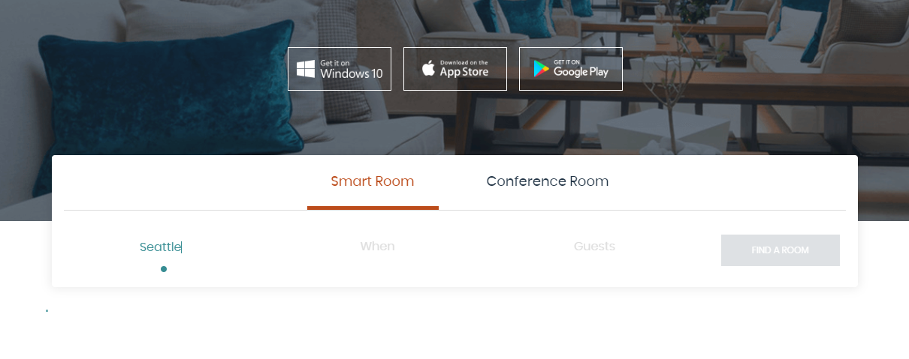
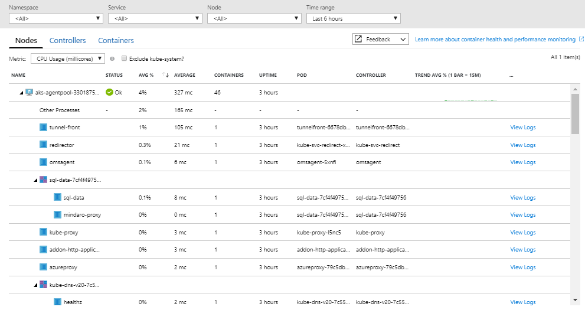
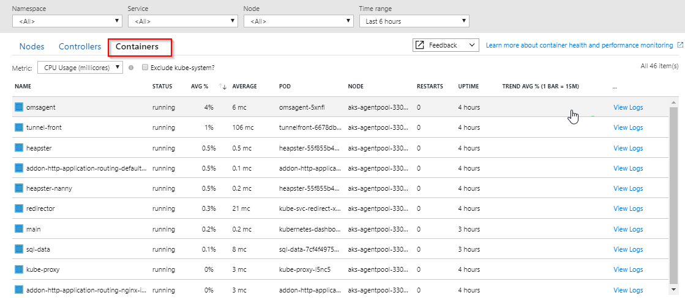
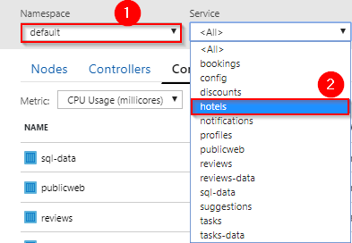
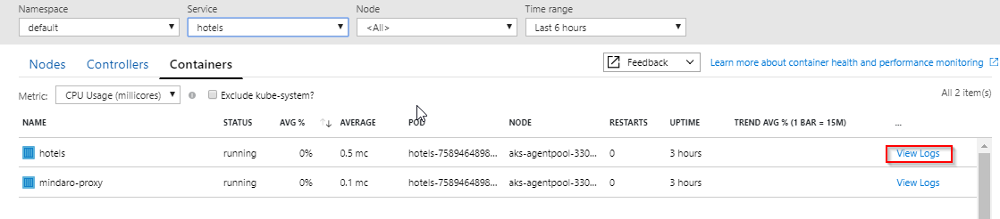
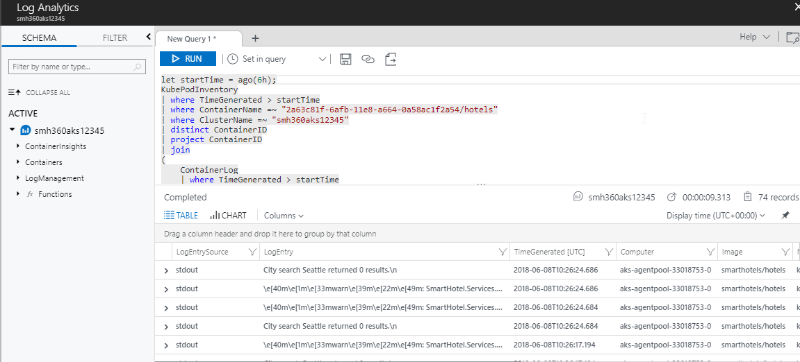
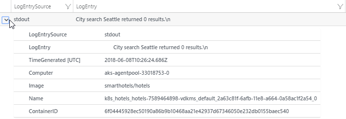
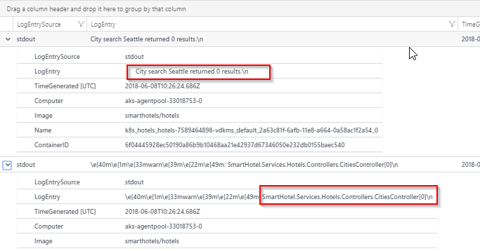
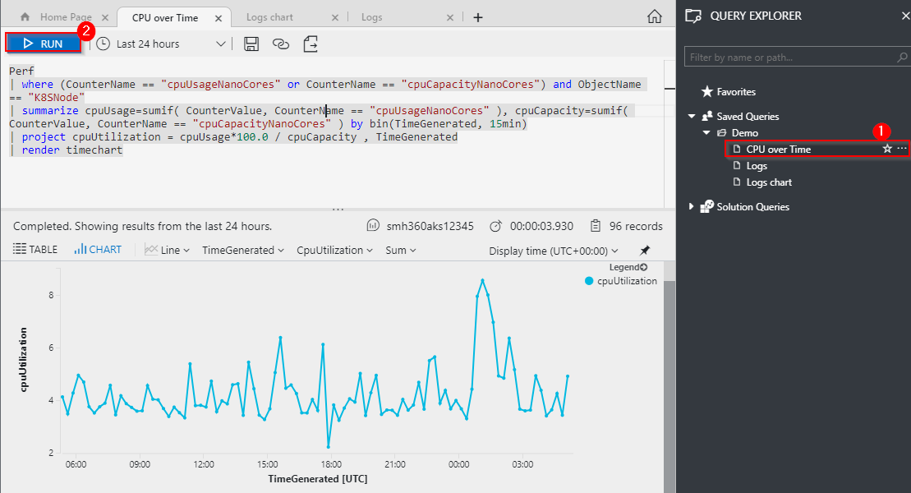
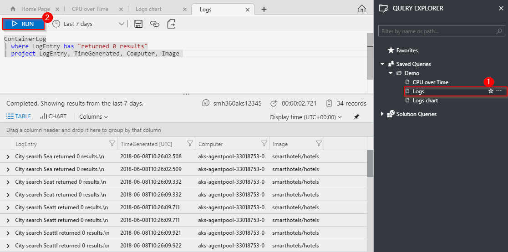

# SmartHotel360-AKS- DevSpaces

## Overview
**SmartHotel360** is a fictitious smart hospitality company showcasing the future of connected travel.
The heart of this application is the cloud – best-in-class tools, data platform, and AI – and the code is built using a microservice oriented architecture orchestrated with multiple Docker containers. There are various services developed in different languages: .NET Core 2.0, Java and Node.js. These services use different data stores like SQL Server, Azure SQL DB, Azure CosmosDB, and Postgres.

In production, all these microservices run in a Kubernetes cluster, powered by Azure Container Service (ACS).

## What’s covered in this lab?

In this lab, you  will
* Create Azure Service Principal
* Provision the required Azure Resources includes Azure ACR, AKS, Log analytics etc..

* Build the images of **SmartHotel360** back-end APIs and Push them to Azure ACR.
* Pull the API images form ACR and run in AKS cluster
* Deploy the **SmartHotel360** public website


## Prerequisites
* Bash command line, which can be accomplished natively on Mac or Linux or using [Windows Subsystem for Linux](https://docs.microsoft.com/en-us/windows/wsl/install-win10) on Windows.
* [Docker](http://www.docker.com/) to build the containers.
* [Visual Studio 2017 Preview](https://www.visualstudio.com/vs/preview/) with the ASP.NET Web workload installed.
* [Azure Dev Spaces Extension](https://docs.microsoft.com/en-us/azure/dev-spaces/get-started-netcore-visualstudio#get-the-visual-studio-tools) for Visual Studio.
* [Azure CLI](https://docs.microsoft.com/en-us/cli/azure/install-azure-cli?view=azure-cli-latest)
* [Kubernetes CLI](https://kubernetes.io/docs/tasks/tools/install-kubectl/)

*  **Microsoft Azure Account**: You will need a valid and active Azure account for the Azure labs. If you do not have one, you can sign up for a [free trial](https://azure.microsoft.com/en-us/free/){:target="_blank"}

   * If you are a Visual Studio Active Subscriber, you are entitled for a $50-$150 credit per month. You can refer to this [link](https://azure.microsoft.com/en-us/pricing/member-offers/msdn-benefits-details/) to find out more including how to activate and start using your monthly Azure credit.

   * If you are not a Visual Studio Subscriber, you can sign up for the FREE [Visual Studio Dev Essentials](https://www.visualstudio.com/dev-essentials/)program to create **Azure free account** (includes 1 year of free services, $200 for 1st month).

## Setup the environment
### **Clone the repository**
Clone the source repository from https://github.com/Microsoft/SmartHotel360-AKS-DevSpaces-Demo.git

### **Create Azure Service Principal** :
 If you already have a service principal, you can re-use it, and if you don't and create one for this demo, you can re-use it to create other AKS clusters in the future. 

1. Login to your Azure subscription and run the below command in [Azure Cloud Shell](https://docs.microsoft.com/en-us/azure/cloud-shell/overview) to create a service principal.

   `az ad sp create-for-rbac --name ServicePrincipalName --password PASSWORD`
   
   

1. Take a note of the output. We will require this details later.

### **Provision the Azure Resources** :
In this step you'll create all of the Azure resources required for this lab. This consists of an AKS Cluster and an Azure Container Registry (ACR) instance. The AKS Cluster is pre-configured to use Microsoft Operations Management Suite (OMS) and Log Analytics to enable the rich Container Health Dashboard capabilities.

1. Install the**Azure Dev Spaces** preview extension for the Azure CLI by entering the following command in the terminal.

   ```bash
   az extension add --name dev-spaces-preview`
   ```
1. Open the `setup\00-set-vars.sh` file in a text editor.
1. Set the variables in the script below (the exports).

   ```bash
   export AKS_SUB=<azure subscription id> \ 
   export AKS_RG=<resource group name> \ 
   export AKS_NAME=<AKS cluster name> \ 
   export ACR_NAME=<Azure Container Registry name> \ 
   export AKS_REGION=eastus \ 
   export SPN_CLIENT_ID=<service principal app id> \ 
   export SPN_PW=<service principal password>
   ```

   Save the file once you're happy with your edits. If you open a new instance of your terminal window or close before ending the process, you can re-run `setup/00-set-vars.sh ` to reset the environment variables the other scripts will use.

   

1. Open a bash terminal. CD into the setup folder of this repository.
1. Some Linux distributions require setting execute permissions on .sh files prior to executing them. To be safe, running the command below results in the bash scripts being enabled with execution privileges.
   ```bash
   chmod +x ./00-set-vars.sh
   chmod +x ./01-aks-create.sh
   chmod +x ./02-deploy-apis.sh
   chmod +x ./03-deploy-web.sh
   chmod +x ../src/SmartHotel360-Azure-backend/deploy/k8s/build-push.sh
   chmod +x ../src/SmartHotel360-Azure-backend/deploy/k8s/deploy.sh
   ```
 1. Run the below command to set the environment variables for the current session.

      ```bash
      source 00-set-vars.sh
      ```
      You can verify the environment variables by running `env` command in the terminal.
1. Run the below command to setup the azure account in the terminal. You need to log in interactively from your web browser.

    ```bash
    az login
    ```

    You get a code to use in the next step as shown below

     

     Use a web browser to open the page [https://aka.ms/devicelogin](https://aka.ms/devicelogin) and enter the code to authenticate.

     Log in with your account credentials in the browser.

1. Run the below command to provision the required Azure resources. 

   ```bash
   source 01-aks-create.sh
   ```


1. It takes about 20-30 minutes to provision the environment. Once the cluster is created, take note of the URL value for the `HTTPApplicationRoutingZoneName` property in the response JSON payload. Copy this URL, as it will be used later when deploying the microservices.

   ```json
    "properties": {
        "addonProfiles": {
        "httpApplicationRouting": {
            "config": {
            "HTTPApplicationRoutingZoneName": "de44228e-2c3e-4bd8-98df-cdc6e54e272a.eastus.aksapp.io"
            }
     ```
   Now that the AKS cluster has been created we can publish the SmartHotel360 microservice source code into it.

## Exercise 1: Deploy the SmartHotel360 Backend APIs to AKS

In this section you'll build the images containing the SmartHotel360 back-end APIs and publish them into ACR, from where they'll be pulled and pushed into AKS when you do your deployment. We've scripted the complex areas of this to streamline the setup process, but you're encouraged to look in the .sh files to see (or improve upon) what's happening.

1. The end-to-end setup script makes use of some of the `export` environment variables you set earlier, so make sure they're still set by using the `echo` command to make sure they're still set. If you don't see values when you `echo` these environment variables, re-run `setup/00-set-vars.sh`.

   ```bash
   echo ${AKS_NAME}
   echo ${AKS_RG}
   echo ${ACR_NAME}
   echo ${AKS_SUB}
   ```
1. Change directory into the `setup` directory (if not already there) and run this command:

     ```bash
     source 02-deploy-apis.sh
     ```
   The script will take some time to execute, but when it is complete the `az aks browse` command will be executed and the Kubernetes dashboard will open in your browser.

1. When the dashboard opens (you may need to hit refresh as it may 404 at first), some of the objects in the cluster may not be fully ready. Hit refresh until these are all green and at 100%. Within a few minutes the cluster will show 100% for all of the objects in it.

    

In this exercise you deployed the back-end APIs to AKS cluster.

## Exercise 2: Set up Ingress
In order to route traffic to the various APIs within the AKS cluster, you'll need to set up a front door, or **ingress**.

1. If you forgot to note the `HTTPApplicationRoutingZoneName` property earlier, execute the command below to get the JSON representation of your cluster.

   ```bash
   az resource show --api-version 2018-03-31 --id /subscriptions/${AKS_SUB}/resourceGroups/${AKS_RG}/providers/Microsoft.ContainerService/managedClusters/${AKS_NAME}
   ```

1. You'll see the `HTTPApplicationRoutingZoneName` property in the JSON in the terminal window. Copy this value as it will be needed in the next step.

    ```json
    "properties": {
    "addonProfiles": {
    "httpApplicationRouting": {
        "config": {
        "HTTPApplicationRoutingZoneName": "de44228e-2c3e-4bd8-98df-cdc6e54e272a.eastus.aksapp.io"
        }
    ```
1.  Open the `ingress.yaml` file from the path `/src/SmartHotel360-Azure-backend/deploy/k8s/` and and see line 14, which has the `host` property set as follows:
    ```json
    spec:
     rules:
     - host: sh360.<guid>.<region>.aksapp.io
      http:
    ```
1. Replace the `host` property with the `sh360`. followed by value you copied earlier.

   ```json
   spec:
     rules:
    - host: sh360.de44228e-2c3e-4bd8-98df-cdc6e54e272a.eastus.aksapp.io
      http:
   ```

1. Execute the command below to set the AKS cluster ingress.

   ```bash
   kubectl apply -f ../src/SmartHotel360-Azure-backend/deploy/k8s/ingress.yaml
   ```

1. Open up the `src/SmartHotel360-public-web/manifests/ingress.yaml` file and see line 9, which has the `host` property set as follows:

    ```yaml
    spec:
      rules:
      - host: sh360.<guid>.<region>.aksapp.io
        http:
    ```

1. Replace the `host` property with the `sh360.` followed by value you copied earlier. 

    ```yaml
    spec:
      rules:
      - host: sh360.de44228e-2c3e-4bd8-98df-cdc6e54e272a.eastus.aksapp.io
        http:
    ```


## Exercise 3: Deploy the Public Web App

Now that the back-end APIs are in place the public web app can be pushed into the cluster, too. The spa app makes calls to the APIs running in the cluster and answers HTTP requests at the ingress URL you used earlier.

1. The end-to-end setup script makes use of some of the `export` environment variables you set earlier, so make sure they're still set by using the `echo` command to make sure they're still set. If you don't see values when you `echo` these environment variables, re-run `setup/00-set-vars.sh`. 

1. CD into the `setup` directory if you're not already there, and execute the command below. 

    ```bash
    source 03-deploy-web.sh
    ```

    The command may take a few minutes to complete. 

1. Once the command completes, paste the string you applied to the `host` property in the `ingress.yaml` files (the `sh360.<guid>.<region>.aksapp.io` string) into a browser, and you'll see the SmartHotel360 public web site load up. 

    

## Exercise 4: Save the queries in Azure portal


There are three queries provided in the [`queries`](../queries) folder of the repository:

* CPU chart of the entire cluster over time
* Error log containing "0 results found" log entry
* Bar chart over time of the error log containing "0 results found" log entry

To make it easy to run these queries in next exercises, paste them in the Log Analytics Query Explorer and click the **Save** button, then give the query a name and category. 

To launch the Log Analytics Query Explorer open the Log Analytics resource created earlier and select Log Search. You launch the Advanced Analytics portal from a link on the Log Search page.


Then they're readily available in the **Saved Queries** folder in the Query Explorer. 


## Exercise 5: Using AKS and Azure Dev Spaces to make developing and debugging apps easier

 Now the **SmartHotel360** web app is setup with back-end APIs deployed to AKS kubernetes cluster. In this exercise we will see how [Azure Dev Spaces](https://docs.microsoft.com/en-us/azure/dev-spaces/azure-dev-spaces) helps development teams be more productive on Kubernetes.

 **Azure Dev Spaces**  enable developers to get up and running, debugging their code directly in the AKS cluster, without the need to configure any environments locally or to need to replicate an AKS cluster and everything in it. Azure Dev Spaces enables a more productive development and debugging process by enabling in-container debugging, within a cluster.  

 

1. Open the public web site in a browser. It should be in the format http://sh360.sh360.guid.region.aksapp.io.

1. Search for **New** using the city search feature on the public web site. The phrase **New** returns some matches as shown below.

     

1. Similarly search for **Sea** or **Seattle**. You could see no results are found. You know that we have hotels in **Seattle**. So this is a Bug.

     

## Debugging Scenario
  Let's assume that you are a new developer working for SmartHotel360, who has been assigned above bug to fix in a huge AKS cluster with a variety of microservices written in Node.js. .NET Core, and Java. And you are armed with a few pre-written queries (Saved queries in Exercise 4) to see logs and CPU usage, and a short description of a defect in the company's web site. Let us see how AKS and Azure DevSpaces will help you to debug, find and fix the issue.

  1. Navigate to the Azure portal and open the deployed AKS overview page.
     
       

     
     The **AKS Overview** page gives you a quick snapshot of how the cluster's operating. 
     
   1. Click **Monitor container Health** link in the portal. The **AKS Health Dashboard** gives a holistic snapshot of all the services running in the AKS cluster. At a glance, you can see that there are a lot of microservices running in there.

      

   1. Click the **Containers** navigation item in the toolbar to switch to **Container view**.  
        
        

   1. Assume that you have been told  the production code is running in the **default** namespace. To look at the containers in the **default** namespace, select **default** from the namespace menu and select **hotels** from the service menu.

        

   1. Click on the **View Logs** link for the **Hotels** service.

        

      AKS gives you the ability to drill right in on a specific container running in production right from within the Azure portal. Now you can view the logs for that specific container.

   1. Wait for the default query to run. If no results are shown in the results pane, increase the parameter for the `ago` method to a greater duration, like `ago(24)` for the past 24 hours of log data.
        
         

      You can see the logs for a specific microservice in the portal.

   1. Expand one of the **City search returned 0 results** log entries. 

       

      These log entries are a good clue providing evidence that this is where the bug's happening, You can get even deeper. Other log entries in the view shows you which ASP.NET MVC Controller are dropping in those **0 results** log entries.

   1. Expand one of the `CitiesController` log entries.
     
      

      You can see from the Log Search that the exact class performing the logging is the `CitiesController` class. Now you know where to look in the source code.

  1. Expand the **Saved Queries** in the **Query Explorer** in the Azure portal, select the **CPU over time** query and click **Run**.
       
        

      The query results with a time chart showing the CPU utilization of the container over a time slice.

   1. Select the **Logs** query, click **Run**. This query shows the logs with the **returned 0 results** string, which you've already identified as the source of the bug.
      
       


   1. Open `SmartHotel.Services.Hotels` solution in Visual Studio.
    
       


    

1. Hit `Ctrl-T` to open the Visual Studio `Go to all` search pane.  Type `CitiesController`. Find the `CitiesController` class and click on it. 
    
    

    In the `CitiesController` class take a look at the `Get` method to see if you can find what's wrong. Looks like the previous developer is making two calls to the `GetDefaultCities` method here.

1. Right-click the `GetDefaultCities` method and select `Go to Definition`. 

    

    
1. Scroll up to show the `Get` method. 
    
    

    Looks like the `GetDefaultCities` method returns a static list. The list doesn't contain Seattle, so that explains why it isn't showing up. If you look up above this method, you can see that the `Get` method is the one that actually uses Entity Framework to query the database. 
    
1. Find the line of code in `CitiesController` using the `Where` method:

    ```csharp
    _citiesQuery.GetDefaultCities().Result
        .Where(city => city.Name.StartsWith(name));
    ```

1. Change the code to match this:

    ```csharp
    await _citiesQuery.Get(name);
    ```

    

    Now that you've got the code edited, debug it to make sure it works. 

1. Add a breakpoint on the `return Ok(cities);` line of code in `citiesController` class.

    

    > You are ready to try this out, but you would need to set up all the databases, services, all of it, or at least get a copy of the AKS cluster on your machine or somewhere else so that it won't impact production - or teammates. 

    > This could take hours, or days, to set up and get working properly. You don't want to spend two weeks building a copy of the production environment. 

    > This is where **Azure Dev Spaces** helps you. Without setting up anything, you can select Dev Spaces to use when you want to debug your code. Then, a copy of your service is deployed into AKS, and commands will be routed to that copy of the service. That way, you can debug your code changes **in your own space** without impacting either the production environment **or** your teammates, all of whom may have code running in their own Dev Spaces. 
   

1. Right click the `SmartHotel.Services.Hotels` Visual Studio project. Select **Properties**.
    
    

1. Select **Debug** in the left navigation. 
1. Select **Azure Dev Spaces** from the Profile menu. 

    

    > Here you'll specify that you want to use Azure Dev Spaces as your debugging target. Next, you'll create your own space for your code to run in during your debugging session. 

1. Select the AKS Cluster you want to use. Select **Create New Space** from the Space menu. 

    

     When you hit F5 your code will run in AKS in your own Dev Space. 
    
    

 

1. Enable the **Launch browser** checkbox.
1. Paste in the URL of the site (this should be the web site's public URL running in your cluster).
1. Prefix the URL with the name of the space and `.s.` so that the format is `http://{yourspace}.s.{original URL}`. 

    

    >  By putting in the name of your space with a `.s.` prior to the original URL, all the HTTP calls to the Hotels REST API will be routed to the container running in your own personal Dev Space. 

1. Select **Azure Dev Spaces** from the debug menu. 

    


1. Hit F5 to start the debugger (or click the toolbar button in Visual Studio). 
    
    

    > Now the app will be compiled, then built into a Docker image. That image will then be published up into AKS and initialized in a namespace named with your Azure Dev Space name. Then, the browser will open to the public web site. The URL of the site will include a prefix, however, that will be passed through when REST API calls are made to the Hotels API. Since that prefix is coming through on the URL, Dev Spaces knows that means to route traffic to the Hotels container running in your personal dev space, where you've got the debugger attached. 

1. Once the site opens, zoom in on the URL to show the Dev Space prefix. 
1. Scroll down and search for **Seattle** in the city search box. 
1. In a moment, Visual Studio should obtain focus and the debugger should stop on the line with the breakpoint. 
    
    

    >  Now, when you do the search, the HTTP call will be sent to an instance of the Hotels service you are actively debugging. You can see the code running in the debugger, and all the watches and locals show up. You can see right away that the search hit the database and found a result for "Seattle." 

     You can hit F5 again to let the code continue running. 
    
    

    Now, the search is working. You are ready to commit your code, and you were able to find and fix  bug in minutes. 

    > You can see that with Azure Kubernetes Service, developers will get the best end-to-end experience in the industry for building apps in containers using Kubernetes. Using the Container Health Monitoring you’ll have deep telemetry on how the code is running in your AKS cluster. 

    > When issues arise, you’ll use the integrated Azure Dev Spaces in Visual Studio and VS Code to build and debug your applications in your own spaces, without messing with teammate or production code, and without having to spend days getting up and running. 

  